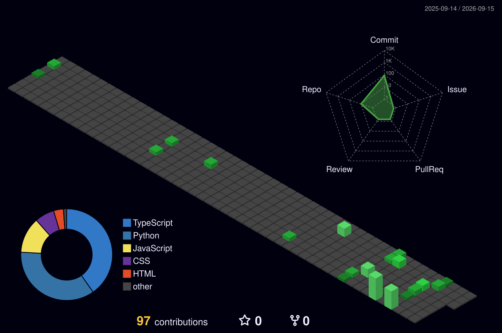

<div align="center">

<!-- Dual-theme hero banners (PNG — reliable on GitHub) -->


<br/>


<br/>

[](https://dharshan-paramasivan.github.io/portfolio/)
[](https://dharshan-paramasivan.github.io/portfolio/Dharshan-Resume.pdf)
[](https://www.linkedin.com/in/dharshan-paramasivan/)
[](mailto:dharshanparamasivan@gmail.com)


</div>

## `> about.exe`

<table>
<tr>
<td width="58%" valign="top">

```yaml
Name:       Dharshan Paramasivan
Role:       Full-Stack · QA Automation · API Security
Education:  M.Sc. Software Systems @ PSG (82%)
Location:   Coimbatore, Tamil Nadu, India
Status:     Open to Software Engineer roles
Mantra:     BUILD -> VERIFY -> SECURE -> SHIP
```

I build full-stack products, verify them with automation, and harden the APIs that carry them -- then ship evidence, not screenshots alone.

</td>
<td width="42%" valign="top">

**Current ops**
- **VortexIoT** -- live IoT monitoring
- Deepening DevOps + system design
- API VAPT · Burp · OWASP ZAP
- Automating messy pipelines

**Live pulse**
<!--LIVE:PULSE:START-->
```bash
$ uptime --profile
user:           DHARSHAN-PARAMASIVAN
public_repos:   14
followers:      1
following:      0
last_sync:      2026-08-17 00:48 UTC
status:         ONLINE | auto-synced by GitHub Actions
```
<!--LIVE:PULSE:END-->

**Quick links**
- [Signal Sheet Portfolio](https://dharshan-paramasivan.github.io/portfolio/)
- [Download Resume PDF](https://dharshan-paramasivan.github.io/portfolio/Dharshan-Resume.pdf)

</td>
</tr>
</table>

<div align="center">

```bash
$ cat ./skills.txt
> Java | Python | JS | React | Next.js | Django | FastAPI | AWS | Docker | Selenium | Burp
```

</div>

## `> cat /skills/*`

<details open>
<summary><b>Languages</b></summary>
<br/>
<div align="center">


`Java` · `Python` · `JavaScript` · `SQL`
</div>
</details>

<details open>
<summary><b>Frontend & Backend</b></summary>
<br/>
<div align="center">


`React` · `Next.js` · `Node.js` · `Express` · `Django` · `FastAPI` · `REST APIs` · `MERN`
</div>
</details>

<details open>
<summary><b>Data · Cloud · DevOps</b></summary>
<br/>
<div align="center">


`PostgreSQL` · `MongoDB` · `MySQL` · `Kafka` · `AWS` · `Docker` · `NGINX` · `Supabase`
</div>
</details>

<details open>
<summary><b>QA · Security · Tools</b></summary>
<br/>
<div align="center">


</div>
</details>

<div align="center">


</div>

## `> ls ./projects`

<table>
<tr>
<td width="50%" valign="top">

### 01 · VortexIoT
**Industrial IoT · 2026**

Machinery health monitoring with real-time telemetry, ML anomaly detection, and cloud deploy.

`Next.js` `FastAPI` `Kafka` `InfluxDB` `AWS` `Docker`

[Live Demo](https://machinary-one.vercel.app/) · Impact: **live production**

</td>
<td width="50%" valign="top">

### 02 · API Security Lab
**VAPT · 2024**

Endpoint discovery, auth testing, and hardening recommendations for REST APIs.

`Burp Suite` `OWASP ZAP` `Postman`

[Code](https://github.com/DHARSHAN-PARAMASIVAN/Vulnerability-Assessment-and-Penetration-Testing-on-API)

</td>
</tr>
<tr>
<td width="50%" valign="top">

### 03 · Appointment System
**Django · 2025**

Role-based booking with secure access control and optimized scheduling.

`Django` `Python` `PostgreSQL`

[Code](https://github.com/DHARSHAN-PARAMASIVAN/Appoinment-Management-System)

</td>
<td width="50%" valign="top">

### 04 · QA Automation Framework
**Selenium · Cucumber · 2025**

End-to-end BDD automation for critical web workflows -- login, data entry, regression.

`Selenium` `Cucumber` `Java` · Impact: **30-40% test time cut**

</td>
</tr>
<tr>
<td width="50%" valign="top">

### 05 · Smart Allocation Engine
**PM Internship Scheme · 2025**

Intelligent allocation matching candidates to internship roles.

`TypeScript` `Algorithms`

[Code](https://github.com/DHARSHAN-PARAMASIVAN/Smart-Allocation-Engine-for-PM-Internship-Scheme-1)

</td>
<td width="50%" valign="top">

### 06 · Skill Sync AI
**AI · Skills · 2025**

AI-assisted skill matching and development workflows.

`Python` `AI`

[Code](https://github.com/DHARSHAN-PARAMASIVAN/Skill-Sync-AI)

</td>
</tr>
<tr>
<td width="50%" valign="top">

### 07 · Study Sync
**Learning platform · 2025**

Study collaboration and learning workflow platform.

`TypeScript`

[Code](https://github.com/DHARSHAN-PARAMASIVAN/Study-Sync)

</td>
<td width="50%" valign="top">

### 08 · Grievances Connect
**Full-stack portal · 2025**

Citizen grievance portal for submit / track / resolve.

`JavaScript` `Full-stack`

[Code](https://github.com/DHARSHAN-PARAMASIVAN/Grievances-Connect)

</td>
</tr>
<tr>
<td width="50%" valign="top">

### 09 · Baby Monitoring
**IoT · 2024**

Real-time IoT alerts for caregiver workflows.

`Python` `IoT`

[Code](https://github.com/DHARSHAN-PARAMASIVAN/Baby-Monitoring-System)

</td>
<td width="50%" valign="top">

### 10 · The Coffee Story + CineHub
**Django / UI · 2024-25**

Django review site + entertainment discovery UI.

[Coffee Story](https://github.com/DHARSHAN-PARAMASIVAN/THE-COFFEE-STORY) · [CineHub](https://github.com/DHARSHAN-PARAMASIVAN/CineHub)

</td>
</tr>
</table>

> Interactive case studies + terminal shell + dual-theme hacker UI on the live site: **[Signal Sheet](https://dharshan-paramasivan.github.io/portfolio/)**

## `> watch --live-repos`

Auto-refreshed every 12 hours from GitHub Actions.

<!--LIVE:REPOS:START-->
| Repo | Latest signal | Lang | Stars |
| --- | --- | --- | ---: |
| [Grievances-Connect](https://github.com/DHARSHAN-PARAMASIVAN/Grievances-Connect) | No description yet. | `JavaScript` | 0 |
| [Grievances_Portal_Mine](https://github.com/DHARSHAN-PARAMASIVAN/Grievances_Portal_Mine) | No description yet. | `JavaScript` | 0 |
| [Study-Sync](https://github.com/DHARSHAN-PARAMASIVAN/Study-Sync) | No description yet. | `TypeScript` | 0 |
| [CineHub](https://github.com/DHARSHAN-PARAMASIVAN/CineHub) | No description yet. | `CSS` | 0 |
| [Skill-Sync-AI](https://github.com/DHARSHAN-PARAMASIVAN/Skill-Sync-AI) | No description yet. | `Python` | 0 |
| [Smart-Allocation-Engine-for-PM-Internship-Scheme-1](https://github.com/DHARSHAN-PARAMASIVAN/Smart-Allocation-Engine-for-PM-Internship-Scheme-1) | No description yet. | `-` | 0 |
| [Appoinment-Management-System](https://github.com/DHARSHAN-PARAMASIVAN/Appoinment-Management-System) | No description yet. | `HTML` | 0 |
| [Code-For-Life](https://github.com/DHARSHAN-PARAMASIVAN/Code-For-Life) | I have Completed the Code For Life Task: | `-` | 0 |
<!--LIVE:REPOS:END-->

## `> tail -f /var/log/activity`

Live public activity stream (auto-synced).

<!--LIVE:ACTIVITY:START-->
- `2026-08-08` pushed **0** commit(s) -> [DHARSHAN-PARAMASIVAN](https://github.com/DHARSHAN-PARAMASIVAN/DHARSHAN-PARAMASIVAN)
- `2026-08-08` pushed **0** commit(s) -> [portfolio](https://github.com/DHARSHAN-PARAMASIVAN/portfolio)
- `2026-07-20` pushed **0** commit(s) -> [DHARSHAN-PARAMASIVAN](https://github.com/DHARSHAN-PARAMASIVAN/DHARSHAN-PARAMASIVAN)
- `2026-07-20` created branch -> [DHARSHAN-PARAMASIVAN](https://github.com/DHARSHAN-PARAMASIVAN/DHARSHAN-PARAMASIVAN)
<!--LIVE:ACTIVITY:END-->

## `> ./snake --contrib`

<div align="center">

<picture>
  <source media="(prefers-color-scheme: dark)" srcset="https://raw.githubusercontent.com/DHARSHAN-PARAMASIVAN/DHARSHAN-PARAMASIVAN/output/github-snake-dark.svg" />
  <source media="(prefers-color-scheme: light)" srcset="https://raw.githubusercontent.com/DHARSHAN-PARAMASIVAN/DHARSHAN-PARAMASIVAN/output/github-snake-light.svg" />
  
</picture>

<br/>


</div>

## `> render --3d-contrib`

Daily 3D contribution map (appears after the first Actions run).

<div align="center">



</div>

## `> history --experience`

```bash
┌──────────┬────────────────────────┬──────────────────────────────────────────────┐
│  2025    │ Fulcrum Technologies   │ Tester Intern · Selenium/Cucumber            │
│          │                        │ → 40% testing-time reduction                 │
├──────────┼────────────────────────┼──────────────────────────────────────────────┤
│  2025    │ Pinsphere Solutions    │ Full-Stack Intern · Django/PostgreSQL/REST   │
│          │                        │ → 25% backend performance gain               │
├──────────┼────────────────────────┼──────────────────────────────────────────────┤
│  2026    │ VortexIoT              │ Industrial IoT · Next.js/FastAPI/Kafka/AWS   │
│          │                        │ → live production deployment                 │
└──────────┴────────────────────────┴──────────────────────────────────────────────┘
```

## `> certs --list`

<div align="center">


</div>

## `> stats`

<div align="center">


<br/>


<br/>


<br/>

## `> trophies --unlock`


</div>

## `> nmap contact`

```bash
$ nmap -sV dharshan.paramasivan
PORT     STATE  SERVICE
25/tcp   open   smtp      dharshanparamasivan@gmail.com
443/tcp  open   https     linkedin.com/in/dharshan-paramasivan
22/tcp   open   ssh       github.com/DHARSHAN-PARAMASIVAN
443/tcp  open   https     dharshan-paramasivan.github.io/portfolio
Nmap done: 1 host up -- access granted
```

<div align="center">

[](https://github.com/DHARSHAN-PARAMASIVAN)
[](https://dharshan-paramasivan.github.io/portfolio/)
[](https://dharshan-paramasivan.github.io/portfolio/Dharshan-Resume.pdf)

<br/><br/>


`root@signal-sheet:~$ exit` · thanks for visiting

</div>
